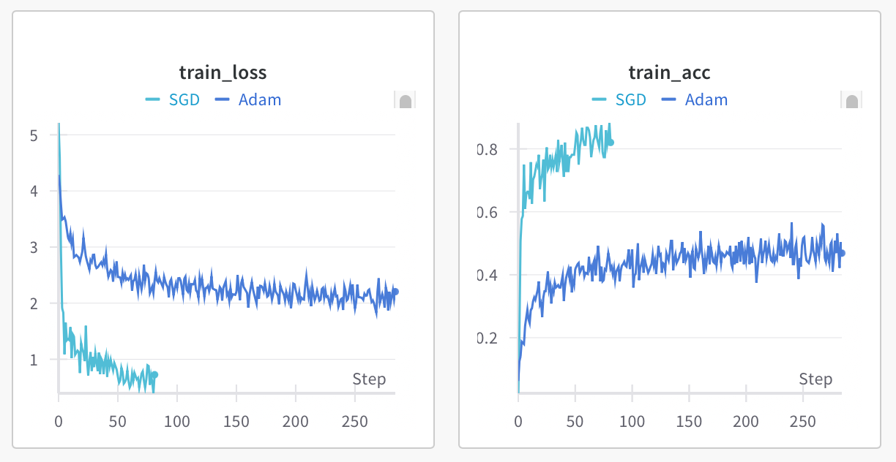

Recently I trained a CNN model on Tiny imagenet dataset.

As I expected, the Adam optimzer gave me better result when training the model from scratch. However, when fine-tuning, the Adam struggle a lot, on the opposite, SGD+ momentum gave a good result within only a few epochs. I thought Adam is more advanced, but it seems that Adam not always better. 

Experiments were done in the Tiny imagenet dataset, and used efficientnetv2 as the model.

### Adam is better in training model from scratch.
When you train a model from scratch, the weights are initialized randomly. Gradients can vary wildly across layers, especially early in training.

•	It adapts the learning rate per parameter, handling sharp curvature or sparse gradients well
•	It warms up faster, especially when gradients are noisy
•	It doesn’t require much hyperparameter tuning out of the box

### SGD is better when fine-Tuning Pre-Trained Model

In transfer learning or fine-tuning, the situation is different:
•	The network already has good feature representations
•	The gradients are well-formed and less noisy
•	The task usually only requires subtle parameter shifts